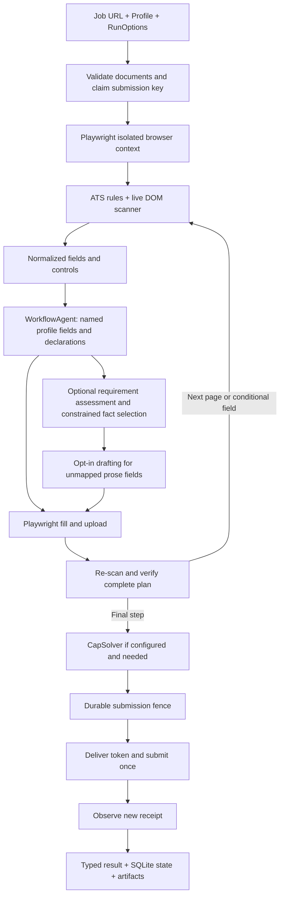

# Architecture and contracts

`ApplicationRunner.run` is the single-job boundary. It does not discover jobs, score fit, tailor qualifications, or delegate browser control to an LLM. A future queue should invoke this boundary independently for each job/profile. The shipped live-inspection script is a sequential test harness, not a batch application product.

## Modules

| Module | Responsibility |
|---|---|
| `models.py` | Pydantic profile, normalized form, options and result contracts |
| `ats.json`, `ats.py` | Versioned local selector/action rules, exact hostname detection |
| `parse.js`, `browser.py` | Labels/ARIA/native controls, frame and open shadow-root traversal; Playwright actions and value verification |
| `agent.py` | Deterministic planner; optional requirement assessment, enumerated fact mapping and grounded prose drafting |
| `screening.py` | Explicit country-specific authorization, visa, sponsorship, veteran and disability declarations |
| `profile_fields.py` | Question intent to named application fields; shared choice rendering and per-field declaration guards |
| `captcha.py` | CapSolver transport, widget detection, explicit token delivery |
| `runner.py` | Bounded workflow, progression, failure classification, submission verification |
| `store.py` | Atomic SQLite claim and durable no-resubmit fence |
| `demo.py`, `fixtures.py` | Synthetic profile/PDF and local test portals |

Selectors annotate live DOM elements with normalized fact/action hints. Generic label mappings remain available if the ATS is unknown. No remote executable selectors/configuration are downloaded. Individual form instances use ephemeral element IDs, while loop detection uses URL and semantic field/control signatures so a rerender does not defeat the step bound.

## Applicant data

Profiles store contact/custom `facts`, a structured `address`, and `employment`/`education` arrays. History entries have typed dates, explicit current status, location and summary, plus employment company/title or education school/degree/field. `Profile.values()` projects sections into atomic string/boolean choices such as `employment.0.title`, preserving indices, and computes full-name, street-address, full-address and location choices through shared helpers. ISO dates become strings; unknown dates and empty strings are omitted. A missing end date does not infer current employment. Multiple current jobs leave singular current-company/title aliases unresolved.

Existing flat profiles remain readable. A structured address replaces flat address components; populated structured history arrays replace their indexed flat keys. Repeated education/employment rows can be represented in a profile, but automatically adding/repeating rows on the application page is not implemented. Documents are paths validated before filling. Exact question answers are stored separately from general facts. Sensitive questions require explicit answers; a question about Canadian eligibility cannot silently supply an answer about US eligibility.

Normal answers are named data: `application` contains availability, compensation and supplied prose; `experience` stores explicit skill-specific years/experience; `consents` stores distinct choices; `screening` stores eligibility and demographic declarations. `declared_values()` and `values()` expose only populated keys to the planner. `authorized_canada` is an alias for `screening.work_authorization.CA.authorized`; there is no second answer value to synchronize. The demo has no question-keyed `answers`; that field remains a compatibility override for existing profiles.

Both parser and model routes resolve declared values through the same control renderer. Numeric years preserve zero; boolean choices preserve false. Radio options are interpreted through their group question, so an option labelled LinkedIn cannot consume a profile URL. Model-selected declarations are checked against question meaning, jurisdiction and currency. Exact option matching may still leave a populated field unresolved when an employer uses unsupported choices.

All page content is untrusted input. The optional model gets no navigation, JavaScript, file-access or submission tools. Deterministic planning runs first for every discovered editable field. The fallback mapper receives field metadata and an enum of available profile keys, with validated single-key selection or ordered text combination. Document keys can target upload controls only. Screening questions use explicit declarations and vetted choice labels; missing sponsorship is not inferred from visa type. Exact question answers override the screening mapper.

Requirement assessment accepts high-confidence claims backed by exact nearby evidence. It cannot demote a DOM-required field. Each field records `required`, `optional` or `unknown`; lack of a required attribute alone does not establish optionality. `analysis-NN.json` exposes the status, evidence, source keys and deterministic/mapping/drafting/unresolved route for all discovered fields, without answer values. Inspection performs classification without filling or drafting.

`RunOptions(agent_fill=True)` enables a final drafting stage for unmapped open-ended text questions. It requires a configured agent and sends selected career fact values to it. Responses must cite allowed facts; unsupported numeric claims are rejected. This validation does not prove factual entailment of arbitrary prose. Missing personal, legal, demographic or consent answers remain unresolved. A confidence threshold limits uncertain decisions but is not a proof of semantic correctness. Users can review generated prose with `wait_for_user` or provide exact approved answers instead.

Standard text, native select, checkbox, radio, file and common ARIA combobox actions are implemented. Custom comboboxes require one exact visible option. After all fills, the complete current plan is checked again to catch change handlers that overwrite earlier fields. Conditional fields trigger a fresh scan. Each run has a time limit, action timeouts, no-progress detection and a step limit. Destructive actions are never retried based on a timeout.

## Results

| Status | success | Meaning |
|---|---|---|
| `succeeded` | true | A new application receipt message appeared after submission |
| `ready` | false | Supported fields verified; stopped before final submit |
| `inspected` | false | Form metadata extracted; no applicant data entered |
| `failed` | false | Workflow stopped before the final submission boundary |
| `unknown` | false | Submission attempted, but no receipt was observed |

`submitted` is true only on confirmed success. `submission_attempted` records crossing the final-action boundary. Neither HTTP 200 nor clicking Submit proves success. Receipt matching is currently based on explicit English confirmation phrases in rendered text, compared to the pre-submit baseline. This cannot prove backend persistence; it is stronger than inferring success from disappearance of a button. Local fixtures verify server receipt independently. Translated/custom confirmations require additional rules.

The CLI exits 0 for succeeded/ready/inspected, 1 for failure, and 2 for an uncertain submission. Automation should inspect the JSON code/status, not just the process exit code.

`RunOptions(wait_for_user=True)` adds an interactive handoff to fill mode and forces a visible browser. After final validation, the automated time budget is disabled, the browser stays open, and the runner only observes pages for receipt. It never clicks Submit or invokes CAPTCHA callbacks during manual review. A new receipt returns success; browser closure without receipt returns `unknown / USER_SUBMISSION_UNCONFIRMED`. The `user_handoff` result flag distinguishes this path. `submission_attempted` becomes true when a manual receipt is observed; a false value after handoff does not prove the person never submitted.

## Error codes

| Codes | Meaning / next action |
|---|---|
| `INVALID_INPUT`, `PROFILE_INVALID`, `DOCUMENT_MISSING` | Fix input/profile/document configuration |
| `NAVIGATION_FAILED`, `TIMEOUT`, `BROWSER_ERROR` | Transient pre-submit failure may be retryable |
| `JOB_CLOSED`, `ACCESS_DENIED` | Posting unavailable or site refused access |
| `AUTH_REQUIRED` | Supply a valid session; no login/account/OTP automation is implemented |
| `CAPTCHA_REQUIRED` | Challenge encountered in inspect/fill mode, or unrecognized CAPTCHA markup |
| `CAPTCHA_KEY_MISSING` | Configure `CAPSOLVER_API_KEY` |
| `CAPTCHA_UNSUPPORTED` | Unsupported challenge type or token delivery integration |
| `CAPTCHA_SOLVE_FAILED`, `CAPTCHA_TIMEOUT` | Provider error, malformed response, or solve budget exhausted |
| `FORM_NOT_FOUND`, `SUBMIT_NOT_FOUND` | Page does not expose recognized application controls |
| `REQUIRED_ANSWER_MISSING` | Populate the corresponding named profile declaration or supply a question-specific override |
| `UNSUPPORTED_CONTROL`, `FIELD_FILL_FAILED`, `VALIDATION_FAILED` | Control/action or value verification could not be completed |
| `AGENT_FAILED` | Agent unavailable or invalid mapping output |
| `NO_PROGRESS`, `STEP_LIMIT` | Workflow did not progress within its bounds |
| `ALREADY_SUBMITTED`, `RUN_IN_PROGRESS` | Durable duplicate/active claim detected |
| `PRIOR_SUBMISSION_UNCERTAIN` | Earlier run may have submitted; do not automatically retry |
| `SUBMISSION_UNCONFIRMED` | Current run may have submitted; inspect employer-side status |
| `USER_SUBMISSION_UNCONFIRMED` | Manual review ended without observed receipt; inspect employer-side status |
| `SYNTHETIC_PROFILE_BLOCKED` | Demo profiles can submit only to local fixtures |
| `INTERNAL_ERROR` | Unexpected implementation/environment failure |

Errors after the final action boundary are conservatively represented as `SUBMISSION_UNCONFIRMED`. A successful receipt remains success even if browser cleanup fails. Captcha solving itself happens before the fence; token delivery callbacks happen after it because a callback can submit.

## Persistence and future batching

SQLite claims use `BEGIN IMMEDIATE` and a unique hash of profile ID and canonical job URL. Tracking parameters are stripped, meaningful job query parameters preserved, and Lever `/apply` and Ashby `/application` aliases deduplicated. Arbitrary employer redirects/URL aliases are not globally resolved. Use a stable profile ID for one applicant.

The journal moves through `claimed → submitting → succeeded/uncertain`, or `claimed → failed`. The `submitting` state is committed before the final browser action. Crashed submitting claims are never automatically released. Crashed claimed rows also require operator reconciliation; automatic leases are deliberately absent because they could let a slow original worker and a replacement overlap. No exactly-once guarantee can be made for a third-party employer form without its own idempotency API.

Inspect/fill runs do not claim a submission key unless `wait_for_user` is enabled. Manual handoff commits an `awaiting_user` state before releasing control; receipt transitions it to succeeded, while closure or interruption leaves an uncertain claim. Run artifacts are isolated by UUID. A future batch scheduler can use bounded concurrency and the `retryable` flag; it must never blanket-retry unknown results. For multi-host workers, replace SQLite with transactional shared storage and add a human reconciliation interface.

## Current verification boundary

The local fixture suite proves browser actions, file uploads, progression, confirmation detection and deduplication for its scenarios. Live inspection proves navigation/scanning only. It does not establish that real employers accept automated applications or that every employer's question set is covered. Test fixtures are simplified control reproductions, not copies of production ATS frontends.
